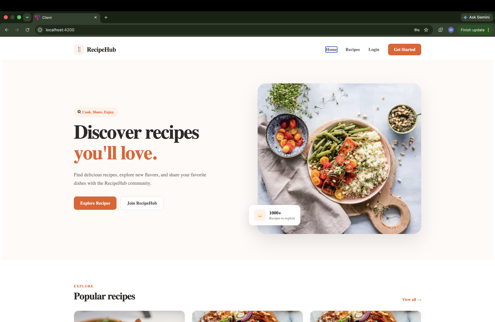
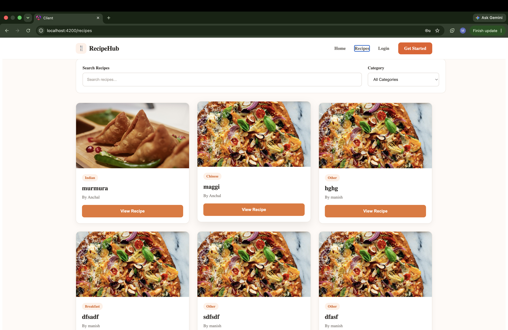
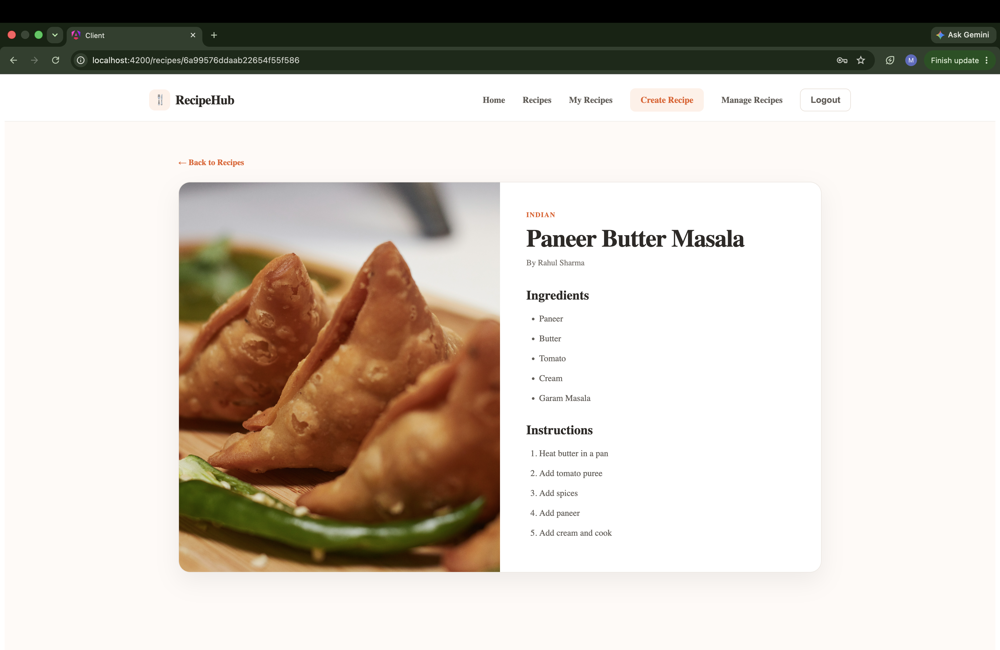
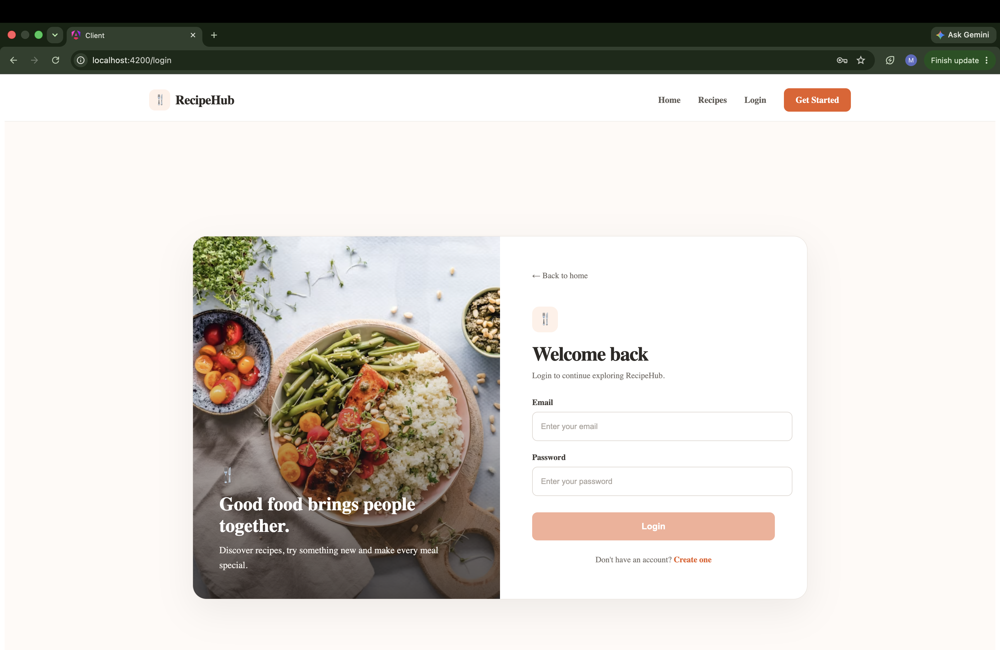
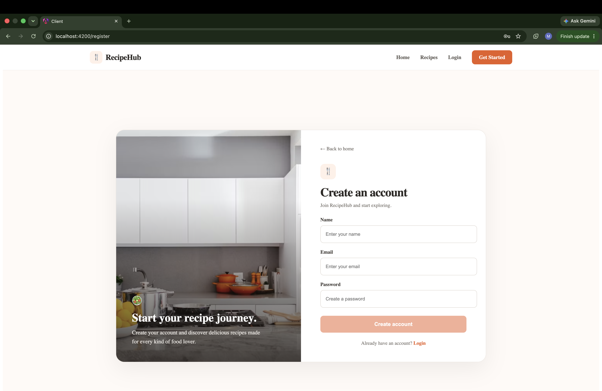
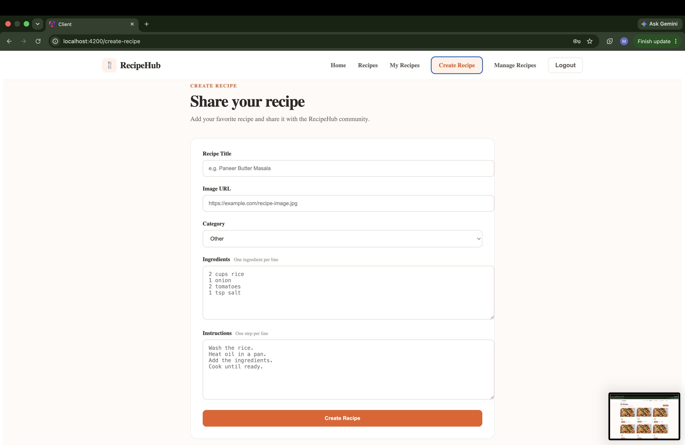
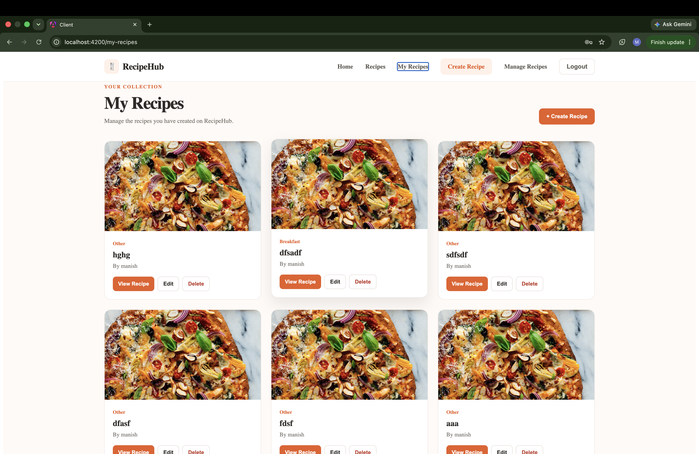
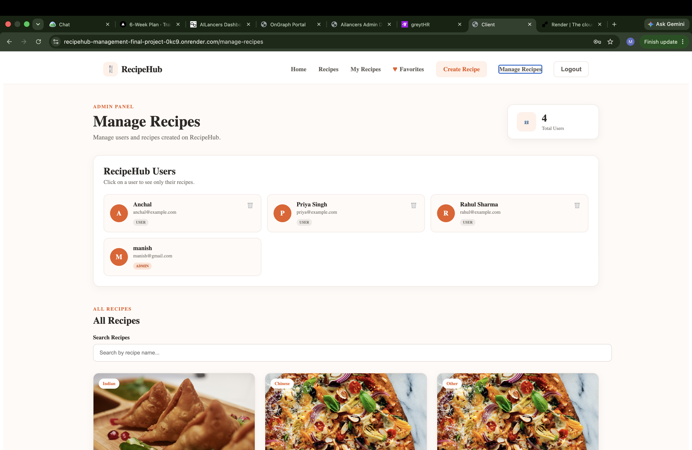
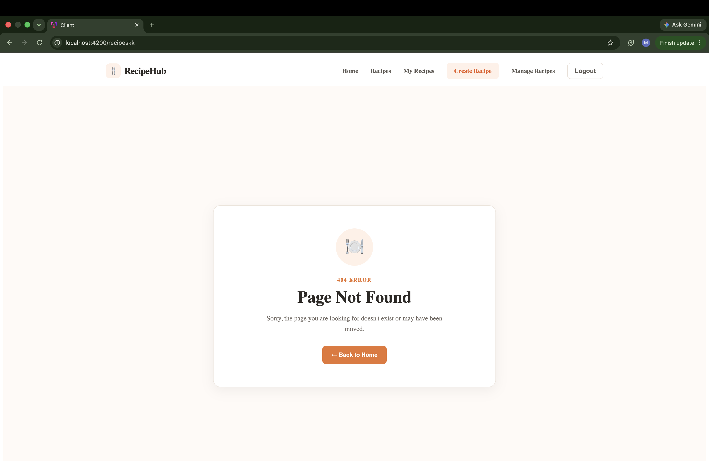

# 🍴 RecipeHub — Full-Stack Recipe Management Application

RecipeHub is a full-stack recipe management application built with **Angular 17+ Standalone Architecture** on the frontend and **Node.js, Express.js, and MongoDB** on the backend.

The application provides secure authentication, role-based authorization, recipe CRUD operations, search, category filtering, pagination, responsive UI, automated API testing, and an integrated **AI Recipe Assistant**.

---

## ✨ Features

### 🔐 Authentication & Authorization

* JWT-based authentication
* Secure password hashing using bcrypt
* User registration and login
* Protected routes
* Role-based access control
* User and Admin roles
* Owner-based recipe authorization
* Centralized `401 Unauthorized` handling

### 🍳 Recipe Management

* Create recipes
* View recipe details
* Update recipes
* Delete recipes
* Owner-based edit/delete permissions
* Admin recipe management
* Recipe categories
* Recipe images
* Ingredients and cooking steps

### 🔍 Search, Filter & Pagination

* Search recipes by title
* Filter recipes by category
* Server-side pagination
* Reactive search using RxJS
* Efficient API requests using:

  * `combineLatest`
  * `debounceTime`
  * `distinctUntilChanged`
  * `switchMap`

### 🤖 AI Recipe Assistant

RecipeHub includes a public AI Recipe Assistant powered by the **Google Gemini API**.

It can help users with:

* 🍳 Recipe recommendations
* 🥗 Ingredient-based suggestions
* 👨‍🍳 Cooking assistance
* 💬 Recipe-related questions

**AI API:**

```http
POST /api/ai/chat
```

Example request:

```json
{
  "message": "Suggest a simple vegetarian dinner recipe"
}
```

### 🛡️ API Security

* Helmet
* CORS configuration
* Rate limiting
* Express-validator
* Centralized error handling
* MongoDB validation
* Invalid MongoDB ID handling
* Protected API routes

### 🧪 Testing

* Jest
* Supertest
* Authentication API tests
* Recipe API tests
* Validation and authorization tests
* Health API tests

### 📱 Responsive UI

* Desktop responsive layout
* Tablet support
* Mobile-friendly design
* Responsive recipe cards
* Loading states
* Error states
* Empty states
* Custom 404 page

---

## 🛠️ Tech Stack

### Frontend

* Angular 17+
* TypeScript
* RxJS
* Reactive Forms
* Angular Signals
* Angular Router
* HttpClient
* HTTP Interceptors
* Functional Route Guards
* Standalone Components
* Lazy Loading
* AsyncPipe
* Modern `@if` / `@for` control flow

### Backend

* Node.js
* Express.js
* MongoDB
* Mongoose
* JWT
* bcrypt
* Express-validator
* Helmet
* CORS
* express-rate-limit

### AI

* Google Gemini API
* Angular
* TypeScript
* RxJS
* Marked

### Testing

* Jest
* Supertest

---

## 🏗️ Project Architecture

```text
RecipeHub
│
├── client/                         # Angular Frontend
│   └── src/
│       ├── app/
│       │   ├── components/
│       │   │   └── navbar/
│       │   │
│       │   ├── pages/
│       │   │   ├── home/
│       │   │   ├── login/
│       │   │   ├── register/
│       │   │   ├── recipes/
│       │   │   ├── recipe-detail/
│       │   │   ├── create-recipe/
│       │   │   ├── edit-recipe/
│       │   │   ├── my-recipes/
│       │   │   ├── manage-recipes/
│       │   │   └── not-found/
│       │   │
│       │   ├── services/
│       │   │   ├── auth.service.ts
│       │   │   └── recipe.service.ts
│       │   │
│       │   ├── guards/
│       │   │   ├── auth.guard.ts
│       │   │   └── admin.guard.ts
│       │   │
│       │   ├── interceptors/
│       │   │   └── auth.interceptor.ts
│       │   │
│       │   ├── models/
│       │   │   └── Recipe.ts
│       │   │
│       │   ├── app.routes.ts
│       │   ├── app.ts
│       │   └── app.html
│       │
│       ├── styles.css
│       └── main.ts
│
└── server/                         # Node.js Backend
    ├── config/
    │   └── db.js
    │
    ├── controllers/
    │   ├── authController.js
    │   └── recipeController.js
    │
    ├── middleware/
    │   ├── authMiddleware.js
    │   ├── validate.js
    │   └── errorMiddleware.js
    │
    ├── models/
    │   ├── User.js
    │   └── Recipe.js
    │
    ├── routes/
    │   ├── authRoutes.js
    │   └── recipeRoutes.js
    │
    ├── validators/
    │   ├── authValidator.js
    │   └── recipeValidator.js
    │
    ├── tests/
    │   ├── health.test.js
    │   ├── auth.test.js
    │   └── recipe.test.js
    │
    ├── .env.example
    ├── server.js
    └── package.json
```

---

## 🔄 Application Flow

```text
Angular Frontend
       │
       ▼
Angular Service
       │
       ▼
HTTP Interceptor
       │
       │ JWT
       ▼
Express REST API
       │
       ├── Authentication
       ├── Validation
       ├── Authorization
       ├── Controllers
       └── Error Handling
       │
       ▼
MongoDB Atlas
```

---

## 🔐 Authentication Flow

```text
Register / Login
       │
       ▼
Express API
       │
       ▼
Validate Input
       │
       ▼
bcrypt Password Verification
       │
       ▼
Generate JWT
       │
       ▼
Angular localStorage
       │
       ▼
HTTP Interceptor
       │
       ▼
Protected API Request
```

---

## 👑 Authorization Flow

```text
Authenticated User
        │
        ▼
    Recipe Action
   View / Edit / Delete
        │
        ▼
     JWT Token
        │
        ▼
  Auth Middleware
        │
        ▼
 ┌──────┴───────┐
 │              │
 ▼              ▼
Owner          Admin
 │              │
 ▼              ▼
Allowed      Override
 │              │
 └──────┬───────┘
        ▼
Recipe Updated / Deleted
```

---

## 📡 Recipe API

| Method | Endpoint           | Access        |
| ------ | ------------------ | ------------- |
| GET    | `/api/recipes`     | Public        |
| GET    | `/api/recipes/:id` | Public        |
| POST   | `/api/recipes`     | Authenticated |
| PUT    | `/api/recipes/:id` | Owner/Admin   |
| DELETE | `/api/recipes/:id` | Owner/Admin   |

### Authentication API

| Method | Endpoint             | Purpose          |
| ------ | -------------------- | ---------------- |
| POST   | `/api/auth/register` | Register user    |
| POST   | `/api/auth/login`    | Login user       |
| GET    | `/api/auth/me`       | Get current user |

### AI API

| Method | Endpoint       | Purpose              |
| ------ | -------------- | -------------------- |
| POST   | `/api/ai/chat` | AI recipe assistance |

---

## 🗄️ Database Models

### User

```text
User
├── name
├── email
├── password
├── role
└── timestamps
```

### Recipe

```text
Recipe
├── owner → User
├── title
├── ingredients[]
├── steps[]
├── category
└── timestamps
```

### Relationship

```text
User
  │
  │ _id
  ▼
Recipe.owner
```

---

## 📸 Screenshots

### Home Page



### Recipes



### Recipe Detail



### Login



### Register



### Create Recipe



### My Recipes



### Admin Management



### 404 Page



---

## 🚀 Local Setup

### 1. Clone Repository

```bash
git clone <your-repository-url>
cd RecipeHub
```

### 2. Backend Setup

```bash
cd server
npm install
```

Create a `.env` file inside the `server/` directory:

```env
MONGO_URI=your_mongodb_connection_string
JWT_SECRET=your_jwt_secret
PORT=3000
```

Start the backend:

```bash
npm start
```

Backend:

```text
http://localhost:3000
```

### 3. Frontend Setup

Open another terminal:

```bash
cd client
npm install
npm start
```

Frontend:

```text
http://localhost:4200
```

Open the application:

```text
http://localhost:4200
```

> Never commit `.env` files, database credentials, API keys, or other secrets to GitHub.

---

## 🧪 Running Tests

From the `server/` directory:

```bash
npm test
```

Current test result:

```text
14/14 tests passed ✅
```

---

## 🌐 Live Demo

### Frontend

**RecipeHub Live Application**

https://recipehub-management-final-project-0kc9.onrender.com/

### Backend

**RecipeHub API**

https://recipehub-management-final-project.onrender.com/

### API Health Check

https://recipehub-management-final-project.onrender.com/api/health

---

## 🔑 Demo Credentials

### 👤 Normal User

```text
Email:    alex@gmail.com
Password: qwerty@123
Role:     user
```

### 👑 Admin User

```text
Email:    manish@gmail.com
Password: 12345678
Role:     admin
```

---

## 📚 Key Concepts Demonstrated

This project demonstrates practical implementation of:

* REST API architecture
* JWT authentication
* Password hashing
* Role-based authorization
* Ownership-based authorization
* MongoDB schema design
* Mongoose relationships
* Express middleware
* Server-side validation
* Centralized error handling
* API security
* Rate limiting
* CORS
* Angular standalone architecture
* Angular Signals
* RxJS operators
* Reactive Forms
* HTTP Interceptors
* Functional Route Guards
* Lazy Loading
* Server-side search
* Filtering
* Pagination
* Automated API testing
* Gemini API integration

---

## 🎯 Project Objective

RecipeHub was developed as a complete full-stack application to demonstrate how a modern Angular frontend can communicate with a secure Node.js/Express REST API and MongoDB database while implementing authentication, authorization, validation, testing, responsive UI, and AI-powered functionality.

---

