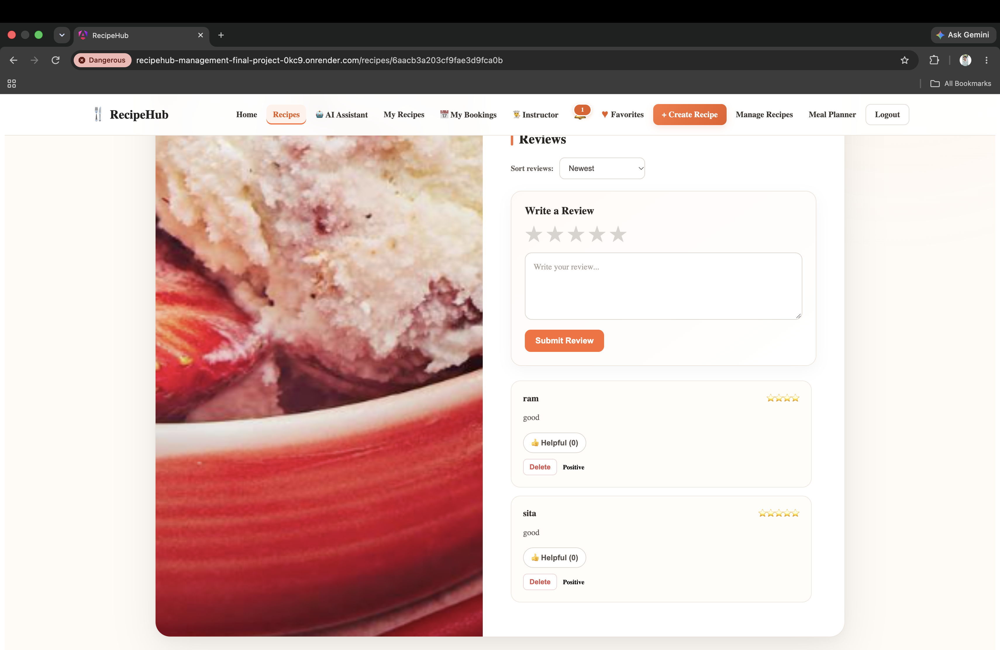
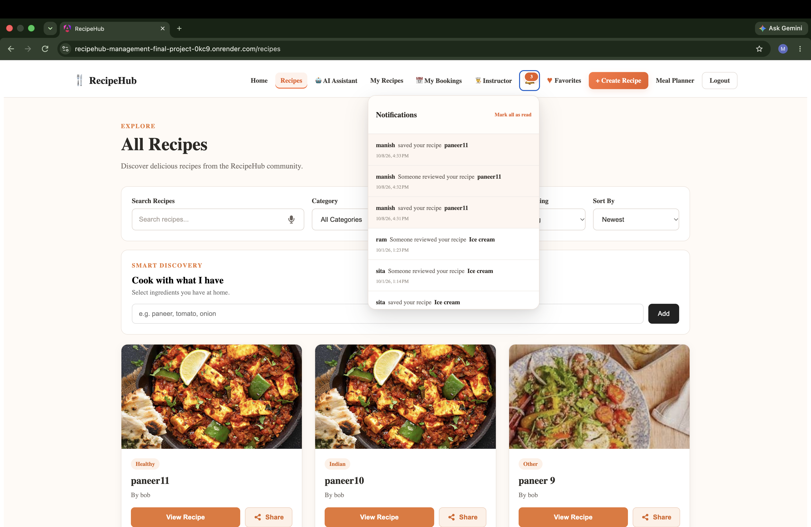
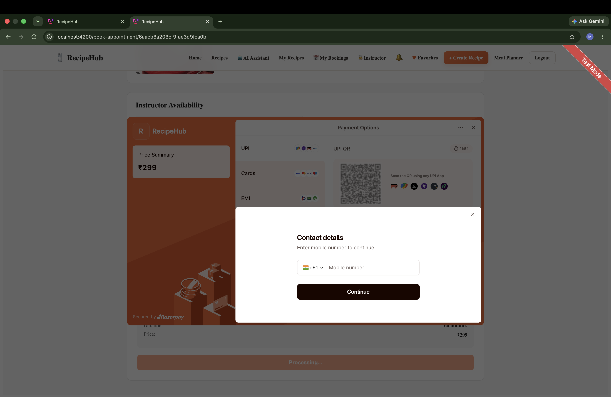

# 🍴 RecipeHub

### Full-Stack Recipe Management & Learning Platform

RecipeHub is a full-stack recipe management and learning platform built with Angular, Node.js, Express.js and MongoDB. It combines recipe creation and discovery with AI assistance, ratings and reviews, favorites, collections, real-time notifications, recipe-learning appointments, payments, meal planning, smart shopping lists and automated testing.

##  Live Demo

- **Frontend:** https://recipehub-management-final-project-0kc9.onrender.com/
- **Backend API:** https://recipehub-management-final-project.onrender.com/
- **Health Check:** https://recipehub-management-final-project.onrender.com/api/health

---

## ✨ Highlights

| Feature | Description |
|---|---|
| 🔐 Authentication | JWT authentication, bcrypt password hashing and protected routes |
| 👑 Authorization | User/Admin roles and owner-based authorization |
| 🍳 Recipes | Complete recipe CRUD with images, ingredients and steps |
| 🔎 Smart Search | Title/ingredient search, category filtering and pagination |
| 🤖 AI Assistant | Recipe assistance powered by Google Gemini |
| ⭐ Reviews | Ratings, reviews, helpful votes and sorting |
| 🧠 AI Review Analysis | Toxicity detection and sentiment analysis |
| ❤️ Favorites | Save and manage favorite recipes |
| 📚 Collections | Personal cookbooks with cover images and public sharing |
| 🖼️ Food Detection | MobileNet validates uploaded recipe images |
| 🔔 Notifications | Persistent real-time notifications with Socket.IO |
| 📅 Appointments | Recipe learning sessions and instructor availability |
| 💳 Payments | Razorpay payment verification for appointments |
| 🗓️ Meal Planner | Weekly breakfast, lunch and dinner planning |
| 🛒 Shopping List | Aggregated ingredients generated from meal plans |
| 👨‍🍳 Cook Mode | Browser text-to-speech cooking instructions |
| 🍽️ Portion Scaling | Dynamically scale ingredient quantities |
| 🖨️ Print/PDF | Print or save shopping lists as PDF |
| 🧪 Testing | Jest, Supertest, Vitest and MongoDB Memory Server |
| ⚙️ CI/CD | GitHub Actions automated validation |
| 📱 Responsive UI | Desktop, tablet and mobile-friendly interface |

---

# 🎯 Project Objective

RecipeHub demonstrates how a modern Angular application can communicate with a secure Node.js/Express REST API and MongoDB backend while integrating AI, real-time communication, payments, automated testing and CI/CD.

The platform lets users discover recipes, create and manage their own recipes, interact through ratings and reviews, save and organize recipes, plan meals, generate shopping lists and learn cooking through interactive features.

---

# ✨ Features

## 🔐 Authentication & Authorization

- User registration and login
- JWT-based authentication
- bcrypt password hashing
- Protected routes
- User and Admin roles
- Role-based access control
- Owner-based recipe authorization
- Centralized unauthorized handling

## 🍳 Recipe Management

- Create, view, update and delete recipes
- Recipe categories
- Recipe images
- Ingredients and cooking steps
- Owner-based edit/delete permissions
- Admin recipe management

## 🔎 Smart Search & Discovery

- Search by recipe title
- Search by ingredients
- MongoDB text search
- Category filtering
- Server-side pagination
- Reactive search with RxJS
- `debounceTime`, `distinctUntilChanged`, `switchMap` and `combineLatest`

## 🤖 AI Recipe Assistant

Powered by Google Gemini API.

- Recipe recommendations
- Ingredient-based suggestions
- Cooking assistance
- Recipe-related questions

```http
POST /api/ai/chat
```

## ⭐ Ratings & Reviews

- 1–5 star ratings
- Recipe reviews
- One review per user per recipe
- Average rating and review count
- Sort by newest, oldest, highest and lowest rating
- Helpful reviews
- Authorized review deletion

## 🧠 AI Review Analysis

### Sentiment Analysis

Model: `Xenova/distilbert-base-uncased-finetuned-sst-2-english`

Classifies reviews as positive, neutral or negative.

### Toxicity Detection

TensorFlow.js Toxicity Model checks reviews for inappropriate content. Toxic reviews are rejected before database storage.

```text
User submits review
        ↓
Validate review
        ↓
Check recipe
        ↓
Check duplicate review
        ↓
Toxicity detection
        ↓
Sentiment analysis
        ↓
Save review
        ↓
Display review + sentiment
```

## ❤️ Favorites

- Save recipes to favorites
- Remove recipes from favorites
- View saved recipes

## 📚 Collections

- Create named collections/cookbooks
- Add and remove recipes
- Server-side pagination
- Collection cover images
- Public collection sharing
- Enable/disable public sharing
- Owner-based authorization
- MongoDB references and Mongoose `populate()`

## 🖼️ AI Food Image Detection

TensorFlow.js MobileNet analyzes uploaded images in the browser before upload.

```text
Select Image → MobileNet → Predictions → Food Image?
                                      ↙          ↘
                                   Accept       Reject
                                     ↓             ↓
                                  Upload        Warning
```

The same validation is used for Create Recipe and Edit Recipe when a new image is selected.

## 🔔 Real-Time Notifications

Socket.IO provides real-time notifications when users review or save another user's recipe. Notifications are also stored in MongoDB and remain available after refresh.

```text
User Action
    ↓
Create Notification
    ↓
Store in MongoDB
    ↓
Socket.IO Event
    ↓
Recipe Owner
```

## 📅 Recipe Learning Appointments

- Book recipe learning sessions
- Instructor availability by day/time
- Automatic slot generation
- 60-minute sessions
- Prevent double booking
- Student and instructor booking views
- Google Meet link support
- Booking/cancellation rules
- Users cannot book their own recipes

## 💳 Razorpay Payments

Appointment payments use Razorpay and are verified before confirmation.

```text
Select Recipe → Select Slot → Create Appointment
       ↓
Razorpay Payment → Verify Payment → Confirm Appointment
```

## 🗓️ Meal Planner

- Weekly meal planning
- Breakfast, lunch and dinner slots
- Select recipes for dates and meal types
- Edit and delete planned meals
- Weekly navigation

## 🛒 Smart Shopping List

Automatically generated from weekly meal plans.

- Aggregate ingredient quantities
- Normalize ingredient names
- Merge duplicate ingredients
- Check/uncheck items
- Persist checked items with `localStorage`
- Clear Checked items
- Empty state
- Dynamic item count

```text
Weekly Meal Plan
      ↓
Collect Ingredients
      ↓
Normalize Names
      ↓
Group Same Ingredients
      ↓
Merge Quantities
      ↓
Shopping List
```

## 👨‍🍳 Cook Mode

Hands-free cooking using browser `speechSynthesis`.

- Read ingredients aloud
- Read cooking steps aloud
- Start
- Pause
- Resume
- Stop
- Works with portion-scaled ingredients

## 🍽️ Portion Scaling

- Increase/decrease servings
- Automatic ingredient recalculation
- Whole numbers
- Decimals
- Fractions
- Integrated with Cook Mode

## 🖨️ Print / Save PDF

- Print shopping list
- Save through browser print dialog as PDF
- Print-specific styling
- Hide navbar/buttons during printing
- A4-friendly layout

## 📱 Responsive UI

- Desktop support
- Tablet support
- Mobile-friendly design
- Responsive recipe cards
- Loading, error and empty states
- Custom 404 page

---

# 🛠️ Tech Stack

## Frontend

- Angular
- TypeScript
- RxJS
- Angular Signals
- Reactive Forms
- Angular Router
- HttpClient
- HTTP Interceptors
- Functional Route Guards
- Standalone Components
- Lazy Loading
- AsyncPipe
- Modern `@if` / `@for` control flow

## Backend

- Node.js
- Express.js
- MongoDB
- Mongoose
- JWT
- bcrypt
- Express Validator
- Helmet
- CORS
- express-rate-limit

## AI / ML

- Google Gemini API
- TensorFlow.js
- MobileNet
- TensorFlow.js Toxicity Model
- Xenova DistilBERT Sentiment Model

## Real-Time / Payments / Storage

- Socket.IO
- Razorpay
- Cloudinary

## Testing / DevOps

- Jest
- Supertest
- Vitest
- MongoDB Memory Server
- Git
- GitHub
- GitHub Actions
- Render
- MongoDB Atlas

---

# 🏗️ Project Architecture

```text
RecipeHub
│
├── client/                    # Angular Frontend
│   └── src/
│       ├── app/
│       │   ├── components/
│       │   ├── pages/
│       │   ├── services/
│       │   ├── guards/
│       │   ├── interceptors/
│       │   ├── models/
│       │   └── app.routes.ts
│       ├── styles.css
│       └── main.ts
│
├── server/                    # Node.js / Express Backend
│   ├── config/
│   ├── controllers/
│   ├── middleware/
│   ├── models/
│   ├── routes/
│   ├── validators/
│   ├── tests/
│   ├── .env.example
│   ├── server.js
│   └── package.json
│
├── .github/
│   └── workflows/
│
└── README.md
```

---

# 🔄 Application Flow

```text
Angular Frontend
       ↓
Angular Services / Signals
       ↓
HTTP Interceptor
       ↓
Express REST API
       ↓
Authentication / Validation / Authorization
       ↓
Controllers / Business Logic
       ↓
MongoDB
```

## 🔐 Authentication Flow

```text
Register / Login
       ↓
Validate Input
       ↓
bcrypt Verification
       ↓
Generate JWT
       ↓
Store Token
       ↓
HTTP Interceptor
       ↓
Protected API Request
       ↓
Authentication Middleware
```

## 👑 Authorization Flow

```text
Authenticated User
       ↓
Recipe Action
       ↓
JWT + Authorization Check
       ↓
 ┌───────────────┐
 │               │
Owner           Admin
 │               │
Allowed         Override
 └───────┬───────┘
         ↓
     Action Allowed
```

## 🔎 Search Flow

```text
Search Input
    ↓
debounceTime
    ↓
distinctUntilChanged
    ↓
API Request
    ↓
MongoDB Text Search
    ↓
Filter + Pagination
    ↓
Recipe Results
```

## 🔔 Notification Flow

```text
Review / Favorite
       ↓
Backend Creates Notification
       ↓
MongoDB
       ↓
Socket.IO
       ↓
Recipe Owner
```

## 🛒 Shopping List Flow

```text
Weekly Meal Plan
       ↓
Recipe Ingredients
       ↓
Normalize Names
       ↓
Group Ingredients
       ↓
Aggregate Quantities
       ↓
Shopping List
       ↓
Check Items / Print / PDF
```

---

# 📡 API Documentation

RecipeHub exposes REST APIs through Express.js.

## Authentication API

| Method | Endpoint | Access | Purpose |
|---|---|---|---|
| POST | `/api/auth/register` | Public | Register user |
| POST | `/api/auth/login` | Public | Login and generate JWT |
| GET | `/api/auth/me` | Authenticated | Get current user |

## Recipe API

| Method | Endpoint | Access | Purpose |
|---|---|---|---|
| GET | `/api/recipes` | Public | Get recipes |
| GET | `/api/recipes/:id` | Public | Get recipe details |
| POST | `/api/recipes` | Authenticated | Create recipe |
| PUT | `/api/recipes/:id` | Owner/Admin | Update recipe |
| DELETE | `/api/recipes/:id` | Owner/Admin | Delete recipe |

## AI API

| Method | Endpoint | Access | Purpose |
|---|---|---|---|
| POST | `/api/ai/chat` | Public | AI recipe assistance |

## Health API

| Method | Endpoint | Access | Purpose |
|---|---|---|---|
| GET | `/api/health` | Public | API health check |

### Additional API Modules

The backend also provides APIs for:

- Reviews and ratings
- Favorites
- Collections
- Notifications
- Meal planning
- Shopping lists
- Appointments
- Payments
- AI processing

> Keep exact endpoint names for these modules synchronized with the actual backend route files.

---

# 🧪 Testing

RecipeHub includes automated testing for both backend APIs and the Angular frontend.

## Backend Testing

Tools:

- Jest
- Supertest
- MongoDB Memory Server

### Coverage

- Authentication
- Recipes
- Collections
- Reviews
- Meal Planner
- Appointments
- Health API
- Validation
- Authorization
- Error handling

### Run Backend Tests

```bash
cd server
npm test
```

### Current Result

```text
Test Suites: 9 passed
Tests:       99 passed
```

## Frontend Testing

Tool:

- Vitest

### Coverage

- Components
- Services
- Forms
- User interactions
- Recipe functionality
- Meal planner
- Shopping list
- UI behavior

### Run Frontend Tests

```bash
cd client
npm test
```

### Current Result

```text
Test Files: 39 passed
Tests:      115 passed
```

## 🗄️ In-Memory MongoDB

Backend tests use **MongoDB Memory Server** so API tests run against an isolated temporary MongoDB instance instead of the production database.

```text
Jest
 ↓
MongoDB Memory Server
 ↓
Mongoose Connection
 ↓
API Tests
 ↓
Database Cleanup
 ↓
Connection Close
 ↓
Memory Server Stop
```

---

# ⚙️ GitHub Actions CI/CD

GitHub Actions automatically validates the project after code changes are pushed.

```text
Git Push
   ↓
GitHub Actions
   ↓
Install Backend Dependencies
   ↓
Run Backend Tests
   ↓
Install Frontend Dependencies
   ↓
Run Frontend Tests
   ↓
Build / Validate
   ↓
CI Result
```

### CI Goals

- Detect regressions automatically
- Run backend API tests
- Run frontend tests
- Validate changes before delivery
- Maintain project reliability

---

# 🗄️ Database Models

## User

```text
User
├── name
├── email
├── password
├── role
└── timestamps
```

## Recipe

```text
Recipe
├── owner → User
├── title
├── ingredients[]
├── steps[]
├── category
└── timestamps
```

The application also maintains data for reviews, favorites, collections, notifications, meal plans and appointments.

---

# 📸 Screenshots

Add screenshots only when the corresponding files exist in the `screenshots/` directory.

## 🏠 Home


## 🍳 Recipes


## 📖 Recipe Details


## 🔐 Login


## 📝 Register


## ➕ Create Recipe


## 👤 My Recipes


## 👑 Admin Management


## 🤖 AI Assistant


## ⭐ Ratings & Reviews



## ❤️ Favorites & Collections


## 🗓️ Meal Planner


## 🛒 Shopping List


## 👨‍🍳 Cook Mode


## 🍽️ Portion Scaling


## 🔔 Notifications



## 📅 Appointments


## 📅 Slot Avalability


## Instructor Dashboard


## Online payment




## ❌ 404


---

# 🚀 Local Setup

## 1. Clone Repository

```bash
git clone <your-repository-url>
cd RecipeHub
```

## 2. Backend Setup

```bash
cd server
npm install
```

Create `server/.env`:

```env
MONGODB_URI=your_mongodb_connection_string
PORT=3000
JWT_SECRET=your_jwt_secret
GEMINI_API_KEY=your_gemini_api_key
CLOUDINARY_CLOUD_NAME=your_cloud_name
CLOUDINARY_API_KEY=your_api_key
CLOUDINARY_API_SECRET=your_api_secret
RAZORPAY_KEY_ID=your_razorpay_key_id
RAZORPAY_KEY_SECRET=your_razorpay_key_secret
```

Start backend:

```bash
npm start
```

Backend: `http://localhost:3000`

## 3. Frontend Setup

```bash
cd client
npm install
npm start
```

Frontend: `http://localhost:4200`

> Never commit `.env` files, API keys, database credentials or other secrets to GitHub.

---

# 🧪 Running Tests

### Backend

```bash
cd server
npm test
```

### Frontend

```bash
cd client
npm test
```

---

# 🔑 Demo Credentials

## 👤 Normal User

```text
Email: bob@gmail.com
Password: 12345678
Role: user
```

## 👑 Admin User

```text
Email: manish@gmail.com
Password: 12345678
Role: admin
```

> Use demo-only credentials for public deployments. Never expose production credentials.

---

# 📚 Key Concepts Demonstrated

- REST API architecture
- JWT authentication
- Password hashing
- Role-based authorization
- Ownership-based authorization
- MongoDB schema design
- Mongoose relationships
- MongoDB aggregation
- Express middleware
- Server-side validation
- Centralized error handling
- API security
- Rate limiting
- CORS
- Angular standalone architecture
- Angular Signals
- RxJS operators
- Reactive Forms
- HTTP Interceptors
- Functional Route Guards
- Lazy Loading
- Server-side search
- Filtering
- Pagination
- Socket.IO real-time communication
- Gemini API integration
- Browser-based machine learning
- Sentiment analysis
- Toxicity detection
- Razorpay payment integration
- Cloudinary image storage
- Automated API testing
- Frontend unit testing
- In-memory database testing
- GitHub Actions CI/CD
- Responsive UI development

---

#  Final Result

RecipeHub combines recipe management, social interaction, AI-powered assistance, learning appointments, payments, real-time notifications, meal planning and smart shopping into a single full-stack application.

The project demonstrates a complete development workflow from frontend and backend implementation to automated testing, in-memory database testing, CI validation and cloud deployment.

---


